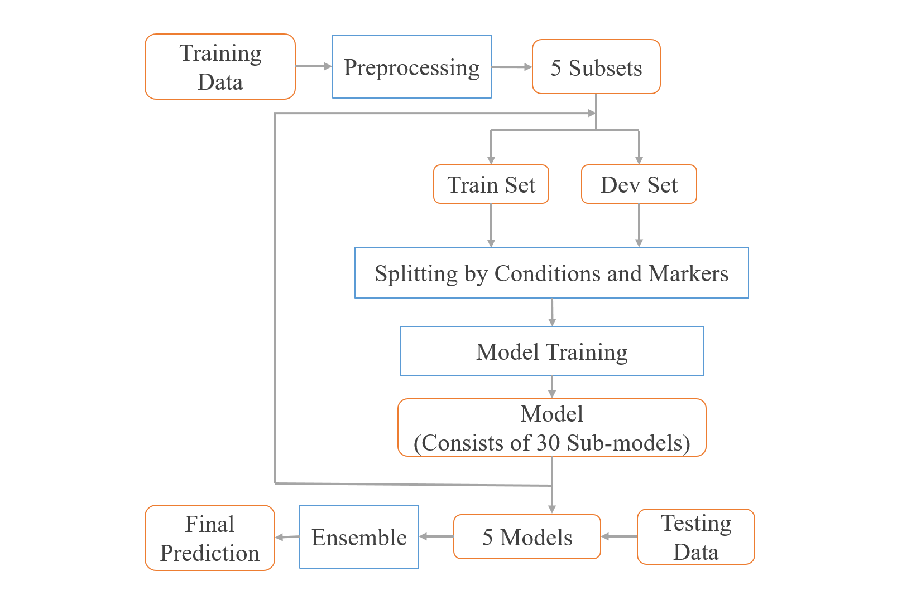

# Write-up for Single Cell Signaling in Breast Cancer Challenge

_Team:_ 
SingleCellLand

_Members:_
Jie Zheng<sup>1</sup>, Piyush Mundra<sup>2</sup>, Xinnan Dai<sup>1</sup>, Jie Wang<sup>1</sup>, Fan Xu<sup>1</sup>

_Affiliation:_
1. School of Information Science and Technology, ShanghaiTech University, Shanghai 201210, China.
2. Cancer Research UK Manchester Institute, Manchester, UK. 

_Contact:_
[@JieZheng_ShanghaiTech](zhengjie@shanghaitech.edu.cn)

Will you be able to make your submission public as part of the challenge archive? Yes

# Introduction
Subchallenge 1 provides two datasets, complete dataset and sub1 dataset. The complete dataset contains expression values of 37 markers in 44 cell lines. Sub1 dataset contains expression values of 32 markers in 6 cell lines. The objective of subchallenge 1 is to predict the expression values of the five missing markers in sub1 dataset.

Therefore, this challenge can be  generally defined as missing value imputation problem. The complete dataset is the training set, and the sub1 dataset is the test set. The general idea is to predict the expression value of the five missing markers based on the known values, which are the expression value of the other 32 markers.

To develop a more targeted prediction, we trained five separate models for each of the five missing markers.  Preliminary results suggested that the expression values of some markers have  correlations with conditions. To consider the influence of conditions, we decided to train separate model for each condition. This resulted into 30 different models, trained for five missing markers and six conditions. For each model, the input was the expression values of 32 markers, and the output is the prediction value of the respective single marker. 

In the modelling part, after comparing linear regression, traditional random forest and lightGBM model, we found lightGBM achieved better performance.

To avoid over-fitting and poor model selection and to utilise the whole dataset, we added an ensemble phase. Here, we randomly split the complete dataset into five subsets of equal size and trained the model on each of the subset. The final result is the average of 5 prediction values.

The figure below shows the implementation of our model.  Our method can be divided into two parts, data preprocessing phase and modelling phase.



## Preprocessing Phase

In the data preprocessing part, we tried to control the quality of input data and transform the data framework to make it more suitable for the next model training phase. The primary operations are listed below:

1. Data Combination: Combine all data from different cell lines into one table.
2. Feature Selection: Select the features we need and drop other columns.
3. Quality Control：Drop the data with nan record.
4. Subset splitting: Randomly split the dataset into 5 subsets with the same size.
5. Data Framework Transform: Split every subset into 6 parts by the 6 conditions.

## Modeling Phase

We defined the combination of a condition and a biomarker as a case. For each case, we trained a separate submodel. In subchallenge 1, there are 5 biomarkers to predict and 6 conditions. Thus, the model is a combination of 30 submodels for 30 different combinations.

In preliminary experiments, we found that the performance of lightGBM model is better than the linear regression model and the random forest model in most of cases. Following tables show the detailed results. Experiments on full dataset again demonstrated that  lightGBM performs better than linear regression and random forest model in these datasets.  Importantly, lightGBM model is an improvement model on Random Forest by regularization on parameters and it is also faster due to parallel computing functionality in the available Python package. Therefore, we decided to use lightGBM to train every submodel.

linearRgression

| | p\.ERK          | p\.Akt\.Ser473\. | p\.S6        | p\.HER2      | p\.PLCg2     |
|---|---|---|---|---|---|
| EGF             | 0\.744466766     | 0\.900491785 | 1\.301817903 | 2\.342058907 | 1\.038661595 |
| full            | 0\.841969778     | 0\.892957088 | 1\.469699073 | 2\.401398237 | 1\.131773001 |
| iEGFR           | 0\.935777149     | 0\.889380234 | 1\.411451614 | 2\.300155564 | 1\.064862088 |
| iP3K            | 0\.813129031     | 0\.838493651 | 1\.425763959 | 2\.278176459 | 1\.03515435  |
| iMEK            | 0\.802415758     | 0\.914258136 | 1\.396478471 | 2\.295195731 | 1\.054406837 |
| iPKC            | 0\.761370391     | 0\.85276653  | 1\.423130505 | 2\.498061933 | 1\.050959486 |

 RandomForest 

| | p\.ERK       |  p\.Akt\.Ser473\. | p\.S6        | p\.HER2      | p\.PLCg2     |
|---|---|---|---|---|---|
| EGF          | 0\.722477223     | 0\.964039381 | 1\.343114314 | 0\.85708435  | 1\.103626209 |
| full         | 0\.816507642     | 0\.928074037 | 1\.562233429 | 0\.96481201  | 1\.202368606 |
| iEGFR        | 0\.88936989      | 0\.9360643   | 1\.412118744 | 0\.795691814 | 1\.113078276 |
| iP3K         | 0\.84239449      | 0\.894599819 | 1\.481352942 | 0\.767575274 | 1\.070981604 |
| iMEK         | 0\.778721796     | 0\.952578335 | 1\.397621678 | 0\.775267613 | 1\.095414714 |
| iPKC         | 0\.733555193     | 0\.901939484 | 1\.434572208 | 0\.91190934  | 1\.039446681 |


lightGBM 

| | p\.ERK   | p\.Akt\.Ser473\. | p\.S6      | p\.HER2     | p\.PLCg2    |
|---|---|---|---|---|---|
| EGF      | 0\.72166         | 0\.90194   | 1\.276695   | 0\.776359   | 1\.089637   |
| full     | 0\.79922         | 0\.8751564 | 1\.4570712  | 0\.854754   | 1\.16313307 |
| iEGFR    | 0\.910753        | 0\.890599  | 1\.3463852  | 0\.74129046 | 1\.1010435  |
| iP3K     | 0\.777959        | 0\.8996891 | 1\.300386   | 0\.72305017 | 1\.09844    |
| iMEK     | 0\.8014189       | 0\.833385  | 1\.34493269 | 0\.7294859  | 1\.0295479  |
| iPKC     | 0\.72439326      | 0\.8381907 | 1\.376795   | 0\.773208   | 1\.059067   |


After the preprocessing phase, we have 5 subsets. In the model training phase, each time we use one subset as a validation set and use the combination of the rest 4 subsets as a training set. With 5 subsets, we can train 5 times.

Finally, we got 5 models, and each model is a combination of 30 submodels. We use the 5 models to predict the test set and use the average of prediction results under 5 models as our final prediction results.

# Implementation

Our model is implemented by the python.
First, we load all data and shuffle the data.

```Python
load_data = read_complete_cellline(path
complete_data = shuffle(load_data).reset_index()
complete_data_length = len(complete_data)
```

Split 5 subsets. Trian model 5 times with a for loop. Each model use a subset as validations set and other subsets as training set.

```Python
len_set = complete_data_length // 5
for model_id in range(0, 5):
    dev_index = range(model_id * len_set, (model_id + 1) * len_set )
    dev_data = complete_data[model_id * len_set: (model_id + 1) * len_set ]
    train_data = complete_data.drop(dev_index)
```

Split dataset by conditions and markers:

```Python
for idx, condition in enumerate(condition_list):
    print("get data of current condition: ", condition)
    dp_train_idx = dp_train_split[idx]
    dp_dev_idx = dp_dev_split[idx]

    print("filter columns: unwanted columns, such as 'cellID'")
    dp_train = dp_train_idx[col_list]
    dp_dev = dp_dev_idx[col_list]

    for trg in trg_id:
        print("filter columns: markers to predict:", trg_id)
        x_train = dp_train[feature_tag(col_list, trg_id)].fillna(0).values
        x_dev = dp_dev[feature_tag(col_list, trg_id)].fillna(0).values
        y_train = dp_train[trg].fillna(0).values
        y_dev = dp_dev[trg].fillna(0).values
        print("start training:" + condition + trg + '.m')
        model_path = './model/' + mode + '/' + str(model_id) + '/' + condition + trg + '.m'
        ....

```

Train submodel:

```Python
gbm = lgb.LGBMRegressor(objective='regression', num_leaves=21, learning_rate=0.01,
                                            n_estimators=1000000)
gbm.fit(x_train, y_train, eval_set=[(x_dev, y_dev)], eval_metric='rmse',
                                early_stopping_rounds=10)
joblib.dump(gbm, model_path)
y_pred = gbm.predict(x_dev, num_iteration=gbm.best_iteration_)
```

Fitting and Predicting the data:

```Python
for id, csv in enumerate(test_csv_list):
    for idx, condition in enumerate(condition_list):
        for trg in trg_id:
            model_path = './model/' + mode + '/' + str(model_id) + '/' + condition + trg + '.m'
            y_test_pred = gbm.predict(x_test, num_iteration=gbm.best_iteration_)
            dp_result[trg] = y_test_pred
        rs = rs.append(dp_result)
    rs_df = pd.DataFrame(rs)
    rs_df = pd.DataFrame(rs)
    rs_df.to_csv(out_path + str(model_id) + '/' + csv)
for id, csv in enumerate(csv_list):
    if id == 0:
        data = pd.read_csv(path + csv)[col]
    else:
        reader = pd.read_csv(path + csv)[col]
        data = pd.concat([data, reader])
data.to_csv('./output/'+str(model_id)+'.csv', index=False)

for i in range(5):
    path = './output/' + str(i) + '.csv'
    if flag:
        m = pd.read_csv(path)[col].values
        flag = False
    else:
        m = m + pd.read_csv(path)[col].values
m = m / 5
m.columns = col
rs = pd.merge(tp, df, how='left', on=col)
```


